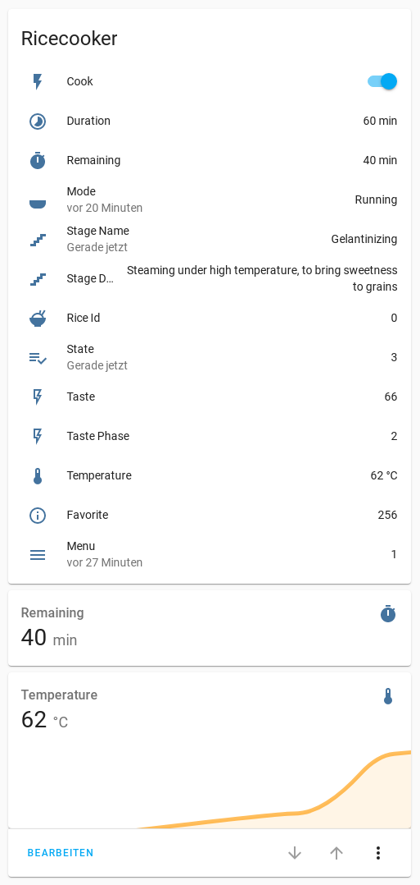
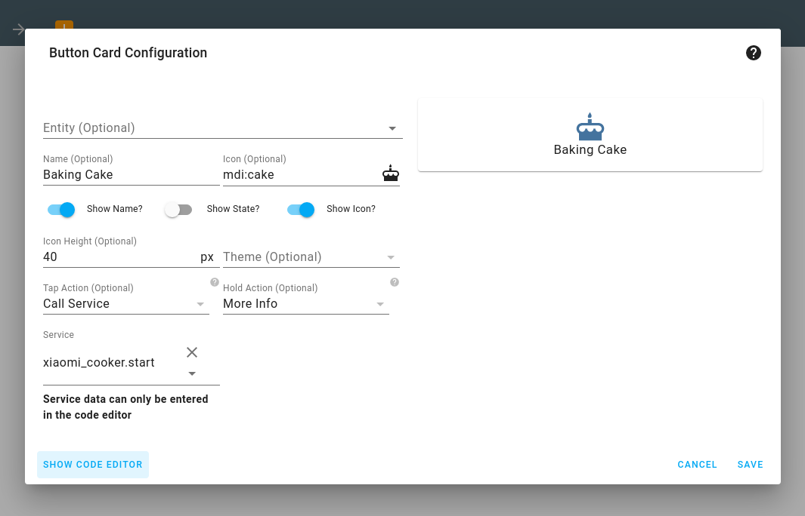
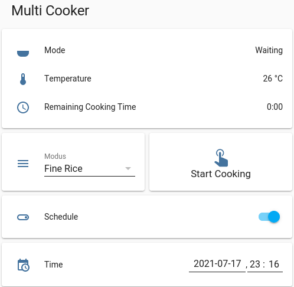
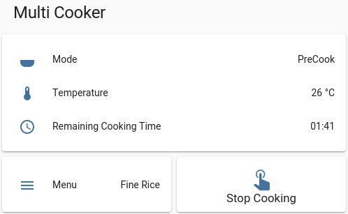

# Xiaomi Mi Electric Rice Cooker


[](https://www.buymeacoffee.com/syssi)

This is a custom component for home assistant to integrate the Xiaomi Mi Electric Rice Cooker V2.

Please follow the instructions on [Retrieving the Access Token](https://www.home-assistant.io/integrations/xiaomi_miio/#xiaomi-cloud-tokens-extractor) to get the API token to use in the configuration.yaml file.

Credits: Thanks to [Rytilahti](https://github.com/rytilahti/python-miio) for all the work.

## Supported devices

| Name                      | Model                  | Model no. |
| ------------------------- | ---------------------- | --------- |
|                           | chunmi.cooker.normal1  | IHFB01CM  |
| Mi IH Rice Cooker         | chunmi.cooker.normal2  | IHFB01CM, 2016DP1293  |
|                           | chunmi.cooker.normal3  | |
|                           | chunmi.cooker.normal4  | |
|                           | chunmi.cooker.normal5  | |
| Mi Smart Pressure Cooker  | chunmi.cooker.press1   | YLIH01CM  |
|                           | chunmi.cooker.press2   | |
| Mi Smart Multi Cooker     | chunmi.cooker.eh1      | |

## Features

### Rice Cooker V2

* Start cooking a profile
* Stop cooking
* Sensors
  - mode
  - menu
  - temperature
  - remaining
  - duration
  - favorite
  - state (available while cooking)
  - rice_id (available while cooking)
  - taste (available while cooking)
  - taste_phase (available while cooking)
  - stage_name (available while cooking)
  - stage_description (available while cooking)
* Switches
  - TODO: Start/Stop is possible if a default profile is available (Recipe input_select?)
  - TODO: Buzzer on/off
  - TODO: Turn off the backlight on idle
* Chart
  - TODO: Temperature History (Like the temperature chart of the weather forecast)
* Services
  - TODO: stop_outdated_firmware
  - TODO: set_no_warnings / set_acknowledge
  - TODO: set_interaction
  - TODO: set_menu
  - TODO: get_temperature_history


## Install

You can install this custom component by adding this repository ([https://github.com/syssi/xiaomi_cooker](https://github.com/syssi/xiaomi_cooker/)) to [HACS](https://hacs.xyz/) in the settings menu of HACS first. You will find the custom component in the integration menu afterwards, look for 'Xiaomi Mi Electric Rice Cooker Integration'. Alternatively, you can install it manually by copying the custom_component folder to your Home Assistant configuration folder.


## Setup

```yaml
# configuration.yaml

xiaomi_miio_cooker:
  name: Xiaomi Rice Cooker
  host: 192.168.130.88
  token: b7c4a758c251955d2c24b1d9e41ce47d
  model: chunmi.cooker.normal2

# template switch example to start a specific cooking profile
switch:
  - platform: template
    switches:
      xiaomi_miio_cooker:
        value_template: "{{ is_state('sensor.xiaomi_miio_cooker_mode', 'Running') }}"
        turn_on:
          service: xiaomi_miio_cooker.start
          data:
            profile: "0001E10100000000000080026E10082B126E1412698CAA555555550014280A6E0C02050506050505055A14040A0C0C0D00040505060A0F086E6E20000C0A5A28036468686A0004040500000000000000010202020204040506070708001212180C1E2D2D37000000000000000000000099A5"
        turn_off:
          service: xiaomi_miio_cooker.stop
```

Configuration variables:
- **host** (*Required*): The IP of your cooker.
- **token** (*Required*): The API token of your cooker.
- **name** (*Optional*): The name of your cooker.
- **model** (*Optional*): The model of your device. Valid values are `chunmi.cooker.normal2` and `chunmi.cooker.normal5`. This setting can be used to bypass the device model detection and is recommended if your device isn't always available.

## Lovelace

```
type: vertical-stack
cards:
  - type: entities
    title: Ricecooker
    state_color: false
    entities:
      - entity: switch.xiaomi_miio_cooker
      - entity: sensor.xiaomi_miio_cooker_duration
      - entity: sensor.xiaomi_miio_cooker_remaining
      - entity: sensor.xiaomi_miio_cooker_mode
        secondary_info: last-changed
      - entity: sensor.xiaomi_miio_cooker_stage_name
        secondary_info: last-changed
      - entity: sensor.xiaomi_miio_cooker_stage_description
      - entity: sensor.xiaomi_miio_cooker_rice_id
      - entity: sensor.xiaomi_miio_cooker_state
        secondary_info: last-changed
      - entity: sensor.xiaomi_miio_cooker_taste
      - entity: sensor.xiaomi_miio_cooker_taste_phase
      - entity: sensor.xiaomi_miio_cooker_temperature
      - entity: sensor.xiaomi_miio_cooker_favorite
      - entity: sensor.xiaomi_miio_cooker_menu
        secondary_info: last-changed
  - type: sensor
    entity: sensor.xiaomi_miio_cooker_remaining
    detail: 2
    hours_to_show: 1
  - type: sensor
    entity: sensor.xiaomi_miio_cooker_temperature
    graph: line
    detail: 2
    hours_to_show: 2
```



If you prefer a button instead of a switch entity you could add a lovelace button card to you dashboard:

```
type: button
tap_action:
  action: call-service
  service: xiaomi_miio_cooker.start
  service_data:
    profile: "010088003201000028000012000000000000000000000846822A6E14002018000F6E82736E140A201810000000000000000000003C8782716E1400200A100000000000000000000000000000000000000000000000000000000000003C0A000000008700000000000000000000000000424D"
hold_action:
  action: more-info
show_icon: true
show_name: true
icon: 'mdi:cake'
name: Baking Cake
icon_height: 40px
```



## Advanced Setup Example (only chunmi.cooker.eh1) [WIP]
The following is an advanced example for a configuration of chunmi.cooker.eh1 supporting the following:

- Show current cooker status: mode, temp, cooking time
- Start the cooker
  - with cooking profile selection
  - with optional schedule
- Stop the cooker




```yaml
# lovelace
type: vertical-stack
title: Multi Cooker
cards:
  - type: entities
    state_color: false
    entities:
      - entity: sensor.xiaomi_miio_cooker_mode
      - entity: sensor.xiaomi_miio_cooker_temperature
      - entity: sensor.cooker_time_remaining
        name: Remaining Cooking Time
  - type: conditional
    conditions:
      - entity: sensor.xiaomi_miio_cooker_mode
        state_not: Waiting
      - entity: sensor.xiaomi_miio_cooker_mode
        state_not: Unknown
    card:
      type: horizontal-stack
      cards:
        - type: entities
          entities:
            - entity: sensor.xiaomi_miio_cooker_menu
          show_header_toggle: true
        - type: button
          tap_action:
            action: call-service
            service: script.rice_cooker_stop
          show_icon: true
          name: Stop Cooking
          show_state: false
          icon: 'mdi:gesture-tap'
          icon_height: 40px
  - type: conditional
    conditions:
      - entity: sensor.xiaomi_miio_cooker_mode
        state: Waiting
    card:
      type: horizontal-stack
      cards:
        - type: entities
          entities:
            - entity: input_select.cooker_programm
          show_header_toggle: true
        - type: button
          tap_action:
            action: call-service
            service: script.rice_cooker_start
          show_icon: true
          name: Start Cooking
          show_state: false
          show_name: true
          icon: 'mdi:gesture-tap'
          icon_height: 40px
  - type: conditional
    conditions:
      - entity: sensor.xiaomi_miio_cooker_mode
        state: Waiting
    card:
      type: entities
      entities:
        - entity: input_boolean.rice_cooker_schedule
  - type: conditional
    conditions:
      - entity: input_boolean.rice_cooker_schedule
        state: 'on'
    card:
      type: entities
      entities:
        - entity: input_datetime.rice_cooker_schedule_time
```

```yaml
# configuration.yaml
sensor:
  - platform: template
    sensors:
      cooker_time_remaining:
        friendly_name: "Kochzeit"
        icon_template: "mdi:clock-outline"
        value_template: >
          
            0:00
          
            {{ ('%02d' % (((states('sensor.xiaomi_miio_cooker_remaining') | int) / 60) | int)) | string + ':' + ( ('%02d' % ((states('sensor.xiaomi_miio_cooker_remaining') | int) % 60)) | string) }}
          
      cooker_menu:
        friendly_name: "Menu"
        icon_template: "mdi:menu"
        value_template: >
          {{
            {
              "0000000000000000000000000000000000000001": "Fine Rice",
              "0101000000000000000000000000000000000002": "Quick Rice",
              "0202000000000000000000000000000000000003": "Congee",
              "0303000000000000000000000000000000000004": "Keep warm",
              "0505000000000000000000000000000000000009": "Cake"
            }[states('sensor.xiaomi_miio_cooker_menu')]
          }}
input_datetime:
  rice_cooker_schedule_time:
    name: Time
    has_time: true
    has_date: true
input_boolean:
  rice_cooker_schedule:
    name: Schedule
input_select:
    cooker_programm:
      name: Modus
      options:
        - Fine Rice
        - Quick Rice
        - Congee
        - Keep warm
        - Cake
      initial: Fine Rice
      icon: mdi:menu
```

```yaml
# scripts.yaml
rice_cooker_start:
  alias: StartRiceCooker
  sequence:
  - service: xiaomi_miio_cooker.start
    data:
      schedule: |
        
          {{ ((state_attr('input_datetime.rice_cooker_schedule_time', 'timestamp') - now().timestamp()) / 60) | int }}
        
          0
        
      profile: |
        {{
          {
            "Fine Rice": "02010000000001e101000000000000800101050814000000002091827d7800050091822d781c0a0091823c781c1e0091ff827820ffff91828278000500ffff8278ffffff91828278000d00ff828778ff000091827d7800000091827d7800ffff91826078ff0100490366780701086c0078090301af540266780801086c00780a02023c5701667b0e010a71007a0d02ffff5701667b0f010a73007d0d032005000000000000000000000000000000cf53",
            "Quick Rice": "02010100000002e100280000000000800101050614000000002091827d7800000091823c7820000091823c781c1e0091ff827820ffff91828278000500ffff8278ffffff91828278000d00ff828778ff000082827d7800000091827d7800ffff91826078ff0164490366780701086c007409030200540266780801086c00760a0202785701667b0e010a7100780a02ffff5701667b0f010a73007b0a032005000000000000000000000000000000ddba",
            "Congee": "02010200000003e2011e0400002800800101050614000000002091827d7800000091827d7800000091827d78001e0091ff877820ffff91827d78001e0091ff8278ffffff91828278001e0091828278060f0091827d7804000091827d7800000091827d780001f54e0255261802062a0482030002eb4e0255261802062a04820300032d4e0252261802062c04820501ffff4e0152241802062c0482050120000000000000000000000000000000009ce2",
            "Cake": "02010400000afe8801000100003700000100000000000000002091827d7800000091827d7800000091827d78001e0066787d7816000091827d7800000091826e7800000091827d7800000091826e7810ffff918266780a000091827d7800000091827d78000000000078821400108714780300000000007882140010871478030000000000788214001087147a050100000000788214001087147d05012000000000000000000000000000000000aa25",
            "Keep warm": "020103000000040c00001800000100800100000000000000002091827d7800000091827d7800000091827d78000000915a7d7820000091827d7800000091826e78ff000091827d7800000091826e7810000091826e7810000091827d7800000091827d780000a082007882140010871478030000eb820078821400108714780300012d8200788214001087147a0501ffff8200788214001087147d0501200000000000000000000000000000000090e5"
          }[states('input_select.cooker_programm')]
        }}
  - service: input_boolean.turn_off
    data: {}
    entity_id: input_boolean.rice_cooker_schedule
  mode: single
rice_cooker_stop:
  alias: StopRiceCooker
  sequence:
  - service: xiaomi_miio_cooker.stop
```

## Debugging

If the custom component doesn't work out of the box for your device please update your configuration to increase the log level:

```
logger:
  default: warn
  logs:
    custom_components.xiaomi_miio_cooker: debug
    miio: debug
```

## Platform services

#### Service `xiaomi_miio_cooker.start`

Start cooking a profile.

| Service data attribute    | Optional | Description                                                          |
|---------------------------|----------|----------------------------------------------------------------------|
| `profile`                 |       no | Profile data which describes the temperature curve.                  |

Some cooking profile examples: https://raw.githubusercontent.com/rytilahti/python-miio/master/miio/data/cooker_profiles.json

- `MODEL_PRESSURE`: `chunmi.cooker.press1`, `chunmi.cooker.press2`
- `MODEL_NORMAL_GROUP1`: `chunmi.cooker.normal2`, `chunmi.cooker.normal5`
- `MODEL_NORMAL_GROUP2`: `chunmi.cooker.normal3`, `chunmi.cooker.normal4`

#### Service `xiaomi_miio_cooker.stop`

Stop the cooking process.
